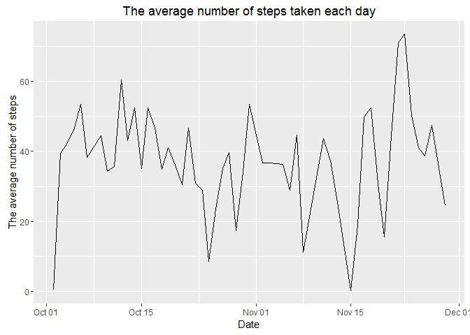

# Reproducible Research: Peer Assessment 1
Rubao Ma  
2016-03-18  


## Loading and preprocessing the data

1. Load the data

```r
unzip("activity.zip")
actdata <- read.csv("activity.csv")
str(actdata)
```

```
## 'data.frame':	17568 obs. of  3 variables:
##  $ steps   : int  NA NA NA NA NA NA NA NA NA NA ...
##  $ date    : Factor w/ 61 levels "2012-10-01","2012-10-02",..: 1 1 1 1 1 1 1 1 1 1 ...
##  $ interval: int  0 5 10 15 20 25 30 35 40 45 ...
```

2. Data processing and transforming
Transform the date format

```r
actdata$date <- as.Date(as.character(actdata$date),"%Y-%m-%d")
```
Replace the 5-minute interval [0,5,10,...,2355] to a sequence as [1,2,3,...,288], because there are 288 5-minute intervals within 24 hour.

```r
actdata$interval <- (actdata$interval %/% 100 *12) + (actdata$interval %% 100 /5 +1)
str(actdata)
```

```
## 'data.frame':	17568 obs. of  3 variables:
##  $ steps   : int  NA NA NA NA NA NA NA NA NA NA ...
##  $ date    : Date, format: "2012-10-01" "2012-10-01" ...
##  $ interval: num  1 2 3 4 5 6 7 8 9 10 ...
```

## What is mean total number of steps taken per day?

1. Histogram of the total number of steps taken each day

```r
sumstepbyday <- aggregate(steps ~ date, actdata, sum)
hist(sumstepbyday$steps,col = "blue",main = "Histogram of the number of steps taken each day",xlab = "Number of Steps")
```


2. Calculate the mean and median number of steps taken per day

```r
summary(sumstepbyday$steps)
```

```
##    Min. 1st Qu.  Median    Mean 3rd Qu.    Max. 
##      41    8841   10760   10770   13290   21190
```

## What is the average daily activity pattern?

1. Time series plot of the average number of steps taken each day

```r
library("ggplot2")
meanstepbyday <- aggregate(steps ~ date, actdata, mean)
qplot(date, steps, data=meanstepbyday,geom="line",main="The average number of steps taken each day",xlab = "Date",ylab = "The average number of steps")
```



2. The 5-minute interval that, on average, contains the maximum number of steps

```r
meanstepbyinter <- aggregate(steps ~ interval, actdata, mean)
inter0 <- meanstepbyinter[meanstepbyinter$steps==max(meanstepbyinter$steps),1]
```
The 104th 5-minute interval contains the maximum average number of steps, which means the interval between 8:35-8:40.

```r
plot(meanstepbyinter$interval, meanstepbyinter$steps,type = "l",col="blue",main="The average number of steps of intervals",xlab = "Intervals",ylab = "The average number of steps")
points(inter0,max(meanstepbyinter$steps),pch=23)
```


## Imputing missing values

1.  The total number of missing values in the dataset (i.e. the total number of rows with NAs)

```r
naflag <- is.na(actdata)
colSums(naflag)
```

```
##    steps     date interval 
##     2304        0        0
```

Only column steps contains missing values, and the total number is 2304.

2.  Fill all of the missing values in the dataset by the mean for that 5-minute interval and submit the output to a new dataset named actdata_filled.

```r
naflag <- naflag[,1]
actdata_filled <- actdata
actdata_filled[naflag,1] <- meanstepbyinter[ actdata[naflag,3] ,2 ]
colSums( is.na(actdata_filled))
```

```
##    steps     date interval 
##        0        0        0
```

3. Histogram of the total number of steps taken each day

```r
sumstepbyday1 <- aggregate(steps ~ date, actdata_filled, sum)
hist(sumstepbyday1$steps,col = "blue",main = "Histogram of the number of steps taken each day \n on filled dataset",xlab = "Number of Steps")
```


4. The mean and median total number of steps taken per day

The mean and median total number of steps taken per day on original dataset:

```r
summary(sumstepbyday$steps)
```

```
##    Min. 1st Qu.  Median    Mean 3rd Qu.    Max. 
##      41    8841   10760   10770   13290   21190
```

The mean and median total number of steps taken per day on filled dataset:

```r
summary(sumstepbyday1$steps)
```

```
##    Min. 1st Qu.  Median    Mean 3rd Qu.    Max. 
##      41    9819   10770   10770   12810   21190
```

After filling the missing values in the original dataset, the median total number of steps taken per day becames larger, while the mean value dose not change.


## Are there differences in activity patterns between weekdays and weekends?

1. Create a new factor variable in the dataset with two levels -- "weekday" and "weekend" indicating whether a given date is a weekday or weekend day.

```r
library("plyr")
actdata_filled <- mutate(actdata_filled,week=weekdays(actdata_filled$date))
actdata_filled$week[actdata_filled$week!="Saturday" & actdata_filled$week!="Saturday"] <- "Weekday"
actdata_filled$week[actdata_filled$week=="Saturday" | actdata_filled$week=="Saturday"] <- "Weekend"
actdata_filled$week <- as.factor(actdata_filled$week)
str(actdata_filled)
```

```
## 'data.frame':	17568 obs. of  4 variables:
##  $ steps   : num  1.717 0.3396 0.1321 0.1509 0.0755 ...
##  $ date    : Date, format: "2012-10-01" "2012-10-01" ...
##  $ interval: num  1 2 3 4 5 6 7 8 9 10 ...
##  $ week    : Factor w/ 2 levels "Weekday","Weekend": 1 1 1 1 1 1 1 1 1 1 ...
```

2. Panel plot containing a time series plot of the 5-minute interval (x-axis) and the average number of steps taken, averaged across all weekday days or weekend days (y-axis).

```r
meanstepbyweek <- aggregate(steps ~ interval+week, actdata_filled, mean)
qplot(interval, steps , data = meanstepbyweek, facets = week ~ ., geom = "line",main="The average number of steps of intervals \n between Weekday and Weekend",xlab = "Intervals",ylab = "The average number of steps")
```


